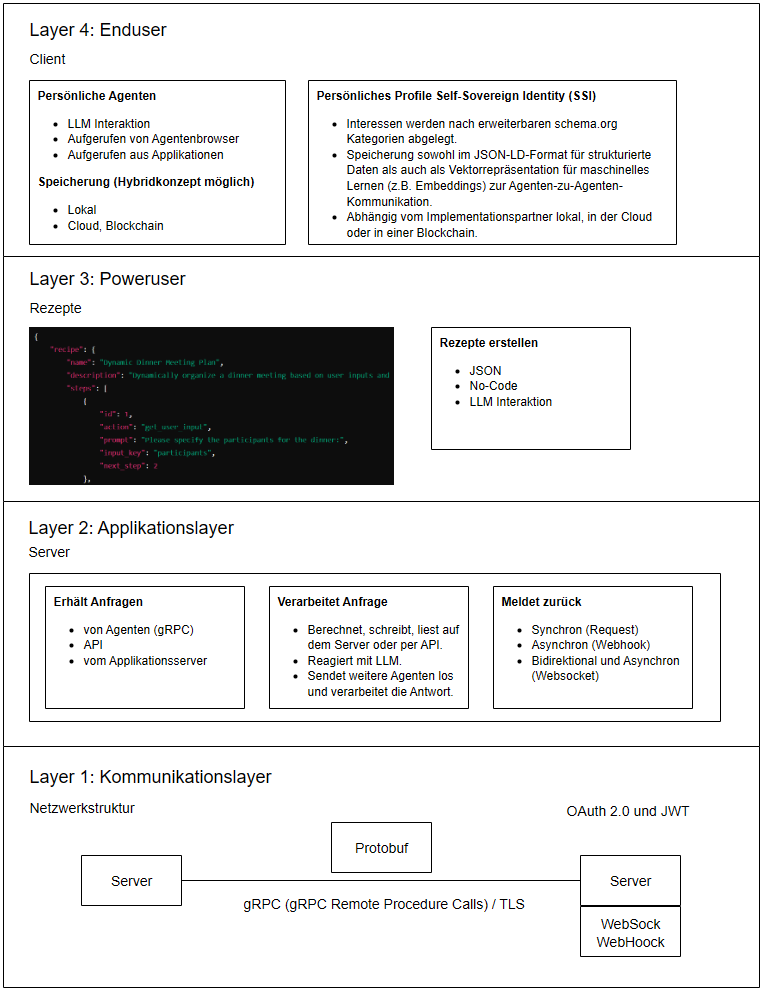
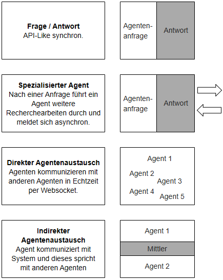
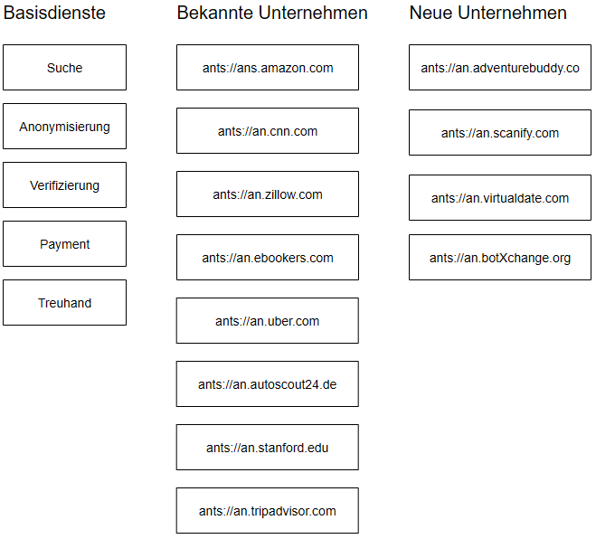
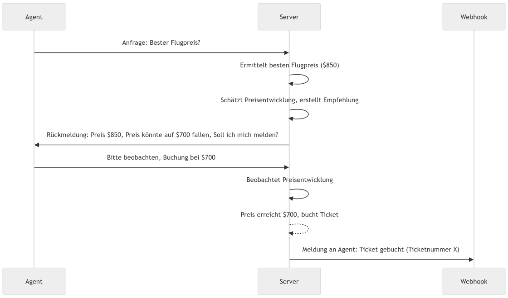
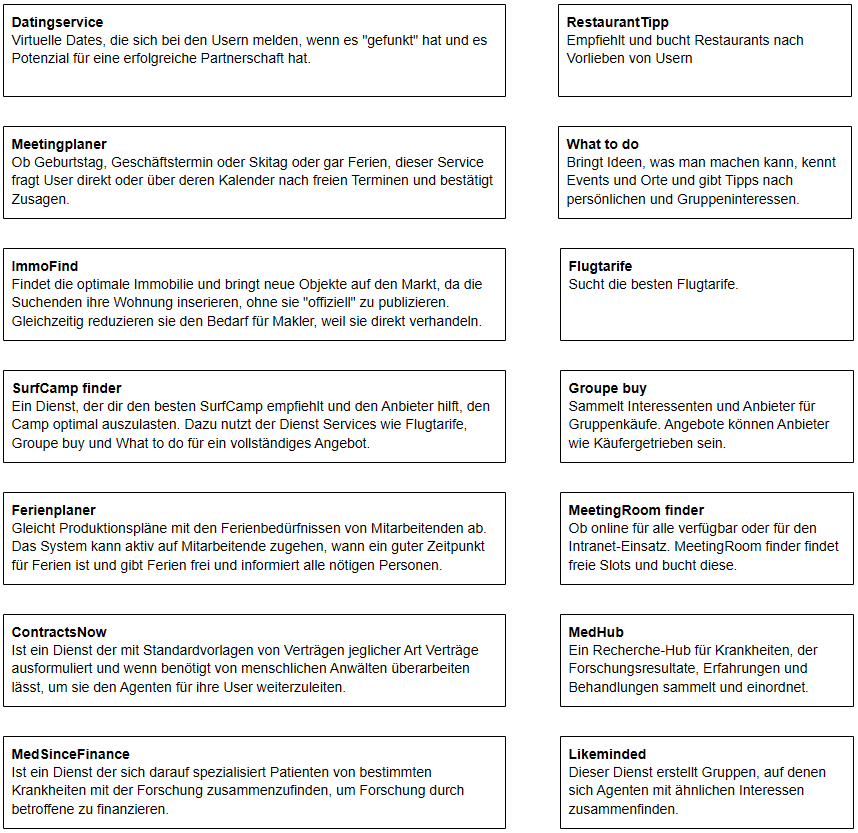

# **Ein dezentrales Agent-zu-Agent-Automatisierungsnetzwerk**

*Das ANTS-Agentennetzwerk kann als „World Wide Web für autonome Agenten“ betrachtet werden, das eine dezentralisierte, skalierbare und standardisierte Plattform bietet, auf der Agenten kommunizieren, zusammenarbeiten und Aufgaben in einem breiten Spektrum von Anwendungen automatisieren können, ähnlich wie Websites und Dienste im traditionellen World Wide Web.*

**Abstract**: Dieses Dokument beschreibt das Konzept eines dezentralen Netzwerks von autonomen Software-Agenten, genannt „AgentNetwork“. Diese Agenten können sowohl einfache wie komplexe Aufgaben in einer verteilten Umgebung selbständig ausführen, ohne auf eine zentrale Autorität angewiesen zu sein. Das Netzwerk besteht aus vier Schichten: Kommunikations- und Sicherheitsschicht, Applikationsschicht, Rezept- und Ablaufschicht sowie Benutzerebene mit autonomer Identität. Es ermöglicht die flexible Interaktion zwischen Agenten über verschiedene Kommunikationsmodelle und unterstützt eine Vielzahl von Anwendungsfällen, die wir heute bereits aus dem Internet kennen, wie Reisebuchungen, Gesundheitsüberwachung und Geschäftsprozessautomatisierung. Darüber hinaus eröffnet es völlig neue Anwendungsmöglichkeiten, die bisher undenkbar waren. Durch seine dezentrale Architektur ist das Netzwerk skalierbar, sicher und unterstützt die Automatisierung komplexer Prozesse sowohl im B2C- als auch im B2B-Bereich. Es wird vom A2AC-Konsortium unterstützt, das Standards, Sicherheit und Innovation vorantreibt. Dieses Dokument richtet sich an technisch versierte Personen, die am Netzwerk teilnehmen oder es weiterentwickeln möchten.

## 

## **Einleitung**

**Problemdefinition und Motivation** 

Die rasante Entwicklung der Informationstechnologie hat unser Leben grundlegend verändert. Computer, Software und das Internet ermöglichen Automatisierung und globale Vernetzung, das World Wide Web (WWW) hat eine Ära der globalen Kommunikation und des globalen Handels eingeläutet. Der Zugang zu Informationen und Dienstleistungen ist heute einfacher und schneller als je zuvor. Die immense Verfügbarkeit von Informationen führt aber auch zu einem neuen Problem: der Überforderung der Nutzenden. Die Vielzahl der Quellen und die Fragmentierung der Informationen erschweren es, den Überblick zu behalten und fundierte Entscheidungen zu treffen.

Künstliche Intelligenz (KI) bietet das Potenzial, dieser Herausforderung zu begegnen, indem sie unsere Fähigkeit, Informationen zu verarbeiten und Entscheidungen zu treffen, automatisiert. Spezialisierte Programme, sogenannte Agenten, können selbstständig agieren, Informationen sammeln und auf deren Grundlage Entscheidungen treffen. Diese Agenten stellen den nächsten Schritt in der Evolution der Technologie dar, indem sie sowohl einfache wie auch komplexe Aufgaben effizienter und schneller als ein Mensch ausführen und dabei auch über selbstlernende Systeme eigenständig effektivere Wege finden.

Um das volle Potenzial dieser Agenten auszuschöpfen, wird ein Netzwerk benötigt, das eine nahtlose Interaktion und Kommunikation zwischen den Agenten ermöglicht. Ein solches Agenten-Netzwerk, ähnlich dem WWW, muss dezentral organisiert sein und den Menschen in den Mittelpunkt stellen, indem es sein Leben einfacher und effizienter macht. Es muss sicher, skalierbar und flexibel sein, um den Anforderungen einer immer komplexer werdenden Welt gerecht zu werden.

Dieses Papier stellt das Konzept des Agenten-Netzwerks vor, erläutert seine Architektur, Anwendungsfälle und die zugrunde liegenden Technologien, um einen Rahmen für die Entwicklung und Implementierung zu schaffen, der den Bedürfnissen von Entwicklern, Anwendern und Unternehmen gerecht wird.

## **Systemarchitektur und Komponentenübersicht**

Das Agenten-Netzwerk ist ein mehrschichtiges, dezentrales System, das die nahtlose Interaktion zwischen spezialisierten Programmen (Agenten) ermöglicht. Diese Agenten handeln im Auftrag der Nutzer, sammeln Informationen, verarbeiten sie und treffen Entscheidungen. Das System ist in vier Schichten unterteilt, die jeweils spezifische Funktionen erfüllen:

**Kommunikations- und Sicherheitsschicht (Layer 1):**  
Diese Schicht regelt die Kommunikation zwischen Agenten und Diensten über gRPC und HTTP/2 mit Protobuf als Datenformat. TLS sichert die Datenübertragung, und eine optionale Ende-zu-Ende-Verschlüsselung erhöht den Schutz sensibler Informationen. Diese Schicht folgt einer Zero-Trust-Architektur mit strenger Authentifizierung und Autorisierung (OAuth 2.0, JWTs).

**Anwendungsschicht (Layer 2):**  
In dieser Schicht werden die Agenten und Dienste implementiert. Anfragen werden über APIs bearbeitet, und die Ergebnisse können synchron (Request-Response), asynchron (Webhooks) oder in Echtzeit (Websockets) zurückgegeben werden. Diese Schicht ist flexibel und erlaubt die Integration externer Dienste sowie die Entwicklung eigener Logik.

**Rezept- und Ablaufschicht (Layer 3):**  
Diese Schicht steuert Arbeitsabläufe und Automatisierungen. Benutzer und Entwickler können "Rezepte" erstellen, die Aufgaben automatisieren. Diese Ebene bietet eine Low-Code-Umgebung, die sowohl technisch weniger versierten Benutzern als auch Entwicklern Flexibilität bietet.

**Benutzerebene und autonome Identität (Layer 4):**  
Ermöglicht den Nutzern, ihre persönlichen Daten sicher zu speichern und zu verwalten. Diese Daten können für personalisierte Dienste genutzt werden, wobei der Nutzer die Kontrolle über die Freigabe behält. Anfragen werden standardmäßig anonym gestellt, und die Kontrolle erfolgt über verschiedene Schnittstellen (z.B. Spracheingabe, Webinterface).

#### **Kommunikationsprotokolle und Sicherheitsvorkehrungen**

Das Agenten-Netzwerk nutzt Technologien wie gRPC, HTTP/2, Protobuf und TLS, um eine effiziente und sichere Kommunikation zu gewährleisten. Eine Zero-Trust-Architektur mit OAuth 2.0 und JWTs stellt sicher, dass nur autorisierte Zugriffe erlaubt sind. Diese Kombination ermöglicht ein skalierbares und sicheres Netzwerk, das höchsten Sicherheitsstandards entspricht.

Um die Architektur des Agenten-Netzwerks besser zu verstehen, zeigt die folgende Grafik die verschiedenen Schichten (Layer), aus denen das Netzwerk besteht. Diese Schichten sind modular aufgebaut, um eine flexible und skalierbare Implementierung zu ermöglichen.

### **Flexible Kommunikationsmodelle im Agenten-Netzwerk**

Ein zentraler Bestandteil des Agenten-Netzwerks ist die flexible Kommunikation zwischen Agenten und Servern, die je nach Anwendungsfall variieren kann:

* Frage / Antwort (API-ähnlich): Agenten stellen Anfragen an den Server und erhalten direkte Antworten, ähnlich wie bei klassischen APIs (synchron).  
* Spezialisierter Agent: Ein Server agiert als spezialisierter Agent, der Anfragen entgegennimmt, zusätzliche Recherchen durchführt und fundierte Antworten asynchron per Webhook liefert.  
* Direkter Agentenaustausch: Agenten kommunizieren direkt miteinander, ohne einen zwischengeschalteten Server. Hier kommunizieren die Agenten in Echtzeit mittels Websocket.  
* Indirekter Agentenaustausch: Ein Agent kommuniziert über einen Vermittler, der die Verbindung zu anderen Agenten herstellt.

Diese Modelle ermöglichen eine effiziente und skalierbare Interaktion im Netzwerk.

  

Die folgende Abbildung gibt einen Überblick über mögliche Marktteilnehmer und Basisdienste, die in das Agenten-Netzwerk integriert werden können. Diese Akteure spielen eine zentrale Rolle bei der Entwicklung und Implementierung spezifischer Dienste und Funktionen.

## **Internet Standardisierung Prozess**

Das **AgentNetworkProtocolSecure (ANTS)**\-Protokoll (`ants://`) ist ein standardisiertes Kommunikationsprotokoll, das speziell für dezentrale, autonome Software-Agenten im AgentNetwork entwickelt wurde. Es ermöglicht sichere und effiziente Kommunikation in verschiedenen Szenarien, darunter synchrone, asynchrone und Echtzeitkommunikation. Dieses Protokoll bietet die notwendige Flexibilität, Skalierbarkeit und Sicherheit, um den Anforderungen eines modernen, dezentralen Netzwerks gerecht zu werden.

Es wird bei der Internet Engineering Steering Group (EITF) als RFC beantragt (https://www.ietf.org/process/process/) 

#### **1\. Protokollübersicht**

* **Protokollname**: AgentNetworkProtocolSecure (ANTS)  
* **URL-Schema**: `ants://`  
* **Verwendung**: Kommunikation zwischen autonomen Agenten im AgentNetwork.

#### **2\. Schichtenmodell**

##### **a) Kommunikations- und Sicherheitsschicht**

* **Transportprotokoll**: gRPC über HTTP/2, gesichert durch TLS 1.3 oder höher.  
* **Authentifizierung**: Verwendung von OAuth 2.0 und JWTs (JSON Web Tokens) für Authentifizierung und Autorisierung.  
* **End-to-End-Verschlüsselung**: Optional, aber empfohlen, um die Privatsphäre und Sicherheit der Kommunikation zu gewährleisten.  
* **Protokollversionierung**: Jede Nachricht im ANS-Protokoll enthält einen `Protocol-Version` Header, der die verwendete Version des Protokolls angibt.

##### **b) Nachrichten- und Anfragestruktur**

* **Anfragetypen**:  
  * `GET`: Abfrage von Informationen.  
  * `POST`: Übermittlung von Daten oder Anweisungen.  
  * `PUT`: Aktualisierung bestehender Daten.  
  * `DELETE`: Löschen von Daten.  
  * **Erweiterte Methoden**:  
    * `DELEGATE`: Übertragung einer Aufgabe an einen anderen Agenten.  
    * `DELEGATE_WITH_CONDITIONS`: Delegation mit spezifischen Bedingungen (z.B. Zeitlimits, Ressourcenbeschränkungen).  
    * `QUERY`: Anforderung spezifischer Informationen.  
    * `UPDATE`: Aktualisierung von Status oder Daten.  
    * `CUSTOM_QUERY`: Definieren und Ausführen komplexer Abfragen.  
* **Header-Felder**:  
  * **Agent-ID**: Eindeutige Identifikation des sendenden Agenten.  
  * **Delegation-Flag**: Gibt an, ob die Anfrage im Auftrag eines anderen Agenten erfolgt.  
  * **Embedding-Info**: Enthält Embeddings oder Metadaten, die für die Kontextualisierung der Anfrage relevant sind.  
  * **Response-Mode**: Gibt an, ob eine synchrone, asynchrone oder Echtzeitantwort erwartet wird.  
  * **Timestamp**: Zeitstempel der Anfrage.  
  * **Protocol-Version**: Version des verwendeten Protokolls.  
* **Body**:  
  * **Data Embeddings**: Optional, enthält maschinenlesbare Daten, die für maschinelles Lernen oder Verarbeitung verwendet werden.  
  * **Response Requirements**: Angaben, ob eine synchrone, asynchrone oder Echtzeitantwort erwartet wird.

##### **c) Statuscodes und Fehlerbehandlung**

* **2xx (Erfolg)**:  
  * `200 OK`  
  * `202 Accepted`: Anfrage akzeptiert, aber die Verarbeitung wird asynchron abgeschlossen.  
  * `204 No Content`: Erfolgreiche Verarbeitung, aber keine Rückgabe erforderlich.  
* **3xx (Umleitung)**:  
  * `304 Not Modified`: Keine Änderungen seit der letzten Anfrage.  
* **4xx (Client-Fehler)**:  
  * `400 Bad Request`: Ungültige Anfrage.  
  * `403 Forbidden`: Zugriffsrechte fehlen.  
  * **Erweiterter Fehlercode**: `450 More Information Required`: Der Server benötigt zusätzliche Informationen zur Verarbeitung.  
* **5xx (Server-Fehler)**:  
  * `500 Internal Server Error`  
  * `503 Service Unavailable`: Temporäre Überlastung oder Wartung.  
  * **Erweiterter Fehlercode**: `550 Processing Delay`: Die Verarbeitung benötigt mehr Zeit; der Agent wird informiert, sobald die Ergebnisse verfügbar sind.  
* **Erweiterte Fehlerbehandlung**: Verwendung der Methode `ERROR_WITH_DETAILS`, um detaillierte Informationen und Korrekturanweisungen bei Fehlern zurückzugeben.

##### **d) Kommunikationsmodelle**

* **Synchron**: Direkte Anfrage und Antwort, typischerweise für einfache Abfragen.  
* **Asynchron**: Anfragen werden entgegengenommen, aber die Antworten werden später, z.B. über Webhooks oder spezialisierte Rückrufmechanismen, zurückgegeben.  
* **Echtzeit**: Verwendung von Websockets für fortlaufende Echtzeitkommunikation.  
* **Asynchrone Datenströme**: Standardmethoden `ASYNC_STREAM_START` und `ASYNC_STREAM_STOP`, um kontinuierliche Datenströme zu handhaben.

#### **3\. Sicherheitsüberlegungen**

##### **a) Zugriffskontrolle und anonyme Anfragen**

* **Authentifizierte Anfragen**: Die meisten Anfragen sind durch strikte Authentifizierungs- und Autorisierungsmechanismen abgesichert, um sicherzustellen, dass nur berechtigte Agenten auf bestimmte Funktionen und Daten zugreifen können.  
* **Anonyme Anfragen**: Das Protokoll unterstützt auch die Möglichkeit, anonyme Anfragen zu stellen. Der Server kann entscheiden, ob er auf solche Anfragen reagiert und wie er diese behandelt.  
  * **Header-Feld**: Anonyme Anfragen sollten einen `Anonymous-Request: true` Header enthalten.

##### **b) Verschlüsselung und Datenintegrität**

* **End-to-End-Verschlüsselung**: Alle Anfragen, ob anonym oder authentifiziert, sollten standardmäßig durch TLS 1.3 oder höher gesichert sein.  
* **Datenintegrität**: Jede Nachricht sollte durch kryptografisches Hashing gesichert werden, um Manipulationen zu verhindern.

##### **c) Audit Logging und Transparenz**

* **Audit Logging**: Authentifizierte Anfragen sollten vollständig protokolliert werden. Bei anonymen Anfragen entscheidet der Server, wie detailliert die Protokollierung erfolgt, um die Anonymität zu wahren.  
* **Echtzeitüberwachung**: Sicherheitsereignisse können in Echtzeit überwacht werden, um potenzielle Bedrohungen zu identifizieren und die Integrität des Systems zu wahren.

##### **d) Sicherheitsstandards und Zertifizierungen**

* **Sicherheitszertifizierungen**: Dienste, die das ANS-Protokoll implementieren, können Sicherheitszertifizierungen durchführen, um ihre Einhaltung von Best Practices und Standards zu demonstrieren.

#### **4\. Abwärtskompatibilität und Migration**

##### **a) Protokollversionierung**

* **Protocol-Version Header**: Jede Nachricht enthält einen `Protocol-Version` Header, um sicherzustellen, dass alle Teilnehmer im Netzwerk wissen, welche Protokollversion verwendet wird.

##### **b) Kompatibilitätsmodi**

* **Backward Compatibility Mode**: Das Protokoll unterstützt einen Modus, der sicherstellt, dass auch ältere Versionen des Protokolls weiterhin interoperabel bleiben.

##### **c) Graceful Degradation**

* **Graceful Degradation**: Das Protokoll ermöglicht eine "Graceful Degradation", bei der Funktionen, die nicht vollständig unterstützt werden, auf minimal funktionale Alternativen zurückgreifen, um die Kommunikation aufrechtzuerhalten.

#### **5\. Beschreibung des Protokolls in Version 1.0**

In der Version 1.0 des ANS-Protokolls sind die folgenden Kernfunktionen und Merkmale vorgesehen:

* **Authentifizierung und Anonymität**: Unterstützung für vollständig authentifizierte und anonyme Anfragen, die flexibel behandelt werden können.  
* **Protokollversionierung**: Jede Nachricht enthält einen `Protocol-Version` Header, um die verwendete Version des Protokolls zu kennzeichnen.  
* **Rückwärtskompatibilität**: Ein Rückwärtskompatibilitätsmodus stellt sicher, dass verschiedene Versionen des Protokolls miteinander kommunizieren können.  
* **Graceful Degradation**: Wenn bestimmte Funktionen nicht unterstützt werden, greift das System auf grundlegende, kompatible Alternativen zurück.  
* **Sicherheitsmechanismen**: Integrierte End-to-End-Verschlüsselung und Maßnahmen zur Sicherstellung der Datenintegrität. Audit Logging für alle Anfragen, wobei bei anonymen Anfragen besonders auf die Wahrung der Anonymität geachtet wird.  
* **Erweiterbarkeit**: Das Protokoll ist so konzipiert, dass es leicht erweitert werden kann, um zukünftige Anforderungen zu unterstützen, ohne die Kernfunktionalitäten zu beeinträchtigen.

## **Anwendungsfälle und Einsatzmöglichkeiten**

Das Agenten-Netzwerk bietet eine Vielzahl von Anwendungsmöglichkeiten, die sowohl den Alltag als auch die Geschäftswelt verändern können. Durch die Automatisierung von Aufgaben und die effiziente Informationsverarbeitung vereinfacht es komplexe und zeitaufwändige Prozesse sowohl im Business-to-Consumer (B2C)- als auch im Business-to-Business (B2B)-Bereich.

### **Ein kurzer Überblick über die Anwendungsfälle:**

* **Reisebuchungen und Preisüberwachung**: Agenten können den besten Flugpreis ermitteln, Preisentwicklungen überwachen und bei Erreichen eines Zielpreises automatisch buchen.  
* **Gesundheitsüberwachung und \-forschung**: Agenten überwachen kontinuierlich Forschungsergebnisse zu bestimmten Krankheiten und verbinden Interessierte mit passenden Studien.  
* **Restaurantempfehlungen und Tischreservierungen**: Agenten geben personalisierte Restaurantempfehlungen und übernehmen bei Zustimmung die Tischreservierung.  
* **Gruppenplanung und Veranstaltungskoordination**: Agenten koordinieren Termine in sozialen Gruppen und übernehmen die Organisation von Veranstaltungen.  
* **Immobilien anbieten ohne anzubieten:** Nutzer, die eine neue Immobilie suchen, können ihre aktuelle Wohnung anonym auf dem Markt anbieten, um direkt Angebote zu erhalten oder Immobilien zu tauschen  
* **Unterstützung von Geschäftsprozessen (B2B und B2C)**: Agenten automatisieren Geschäftsprozesse, erleichtern die Zusammenarbeit und ermöglichen sichere Interaktionen über Extranet-Funktionen.

### **Detaillierte Anwendungsfälle:**

#### **Reisebuchung und Preisüberwachung:**

Ein klassischer Anwendungsfall ist die Automatisierung von Reisebuchungen. Benutzer können einen Agenten beauftragen, den günstigsten Flugpreis für eine bestimmte Strecke zu ermitteln. Der Agent durchsucht verschiedene Flugbuchungsdienste, vergleicht die Preise und gibt eine Empfehlung ab. Zusätzlich kann der Agent die Preisentwicklung über einen bestimmten Zeitraum beobachten und den Nutzer informieren, wenn der Preis ein vorher festgelegtes Zielniveau erreicht hat. Sobald der Zielpreis erreicht ist, übernimmt der Agent automatisch die Buchung und informiert den Nutzer über den erfolgreichen Abschluss.

Die folgende Grafik zeigt den Ablauf dieses Prozesses:  

#### **Erweiterter Anwendungsfall: Group Buy für Flugbuchungen:**
Der klassische Fall einer Flugbuchung kann in einem Agentennetzwerk völlig neu gedacht werden. Ein neuer Dienst, z.B. "Group Buy", könnte sich im Netzwerk registrieren und den Nutzenden anbieten, statt einer normalen Einzelbuchung an einem Gruppenkauf für Flugreisen teilzunehmen. Die Agenten der Nutuzenden registrieren sich für eine gemeinsame Reise, z.B. am Tag X von Zürich nach Los Angeles. Der Group Buy Server sammelt die Interessenten und sobald 200 interessierte Personen zusammen sind, verhandelt der Agent des Group Buy Servers mit den Agenten der verschiedenen Fluggesellschaften, um einen attraktiven Flugpreis auszuhandeln.

Auf diese Weise könnten sogar neue Fluggesellschaften entstehen, die offiziell noch nicht bekannt sind. Diese Fluggesellschaften könnten auf Strecken wie Zürich - Los Angeles Zubringerdienste einrichten, ohne auf klassische Marketingaktivitäten angewiesen zu sein.

#### **Gesundheitsüberwachung und \-forschung:**

Agenten können im Gesundheitsbereich eingesetzt werden, um kontinuierlich die neuesten Forschungsergebnisse zu überwachen, die für bestimmte Krankheiten relevant sind. Sie benachrichtigen den Nutzer, sobald neue relevante Informationen verfügbar sind. Darüber hinaus können Agenten Patienten mit Forschungseinrichtungen verbinden, die an bestimmten Studien interessiert sind, und so den Zugang zu wichtigen medizinischen Informationen und Studien erleichtern.

#### **Restaurantempfehlungen und Tischreservierungen:**

Ein weiteres Beispiel ist die Personalisierung von Restaurantempfehlungen. Der Agent greift auf die gespeicherten Präferenzen des Nutzers wie bevorzugte Küche, Preisvorstellungen oder Bewertungen zu und schlägt passende Restaurants anhand der Reviews von Gästen vor. Hat der Nutzer eine Auswahl getroffen, übernimmt der Agent automatisch die Tischreservierung und bestätigt den Termin, was den gesamten Prozess für den Nutzer erheblich vereinfacht.

#### **Gruppenplanung und Veranstaltungskoordination:**

Die Koordination von Terminen und Veranstaltungen kann gerade in sozialen Gruppen mühsam sein. Hier können Agenten die Kalender der beteiligten Personen überprüfen, mögliche Termine vorschlagen und das Feedback der Teilnehmer einholen. Sobald ein Termin feststeht, können sie weitere organisatorische Aufgaben übernehmen, wie z.B. das Buchen eines Veranstaltungsortes oder das Versenden von Einladungen.

**Immobilien anbieten, ohne sie anzubieten:**  
Ein Nutzer, der eine neue Immobilie sucht, kann gleichzeitig seine aktuelle Wohnung oder sein Haus zur Miete oder zum Verkauf anbieten, ohne diese öffentlich zu inserieren. Der Suchauftrag wird mit einer anonymen Beschreibung und Fotos der eigenen Immobilie versehen. Andere Anbieter oder Suchende, die ein ähnliches Objekt suchen, können sich direkt bewerben oder über mehrere Hops Immobilien tauschen. Dadurch vergrößert sich das Angebot auf dem Markt und die Chance, eine passende Immobilie zu finden, steigt. Gleichzeitig bleibt die Privatsphäre des Nutzers gewahrt, da alle Transaktionen bis zu einer konkreten Einigung anonym erfolgen.

#### **Unterstützung der Geschäftsprozesse (B2B und B2C):**

Das Agenten-Netzwerk eignet sich auch hervorragend zur Automatisierung von Geschäftsprozessen. Innerhalb eines Intranets können Agenten beispielsweise die Produktionsplanung, HR-Aufgaben oder Rechercheaufgaben unterstützen. Über Extranet-Funktionen können Unternehmen zudem sichere Interaktionen mit Partnern und Kunden organisieren, ohne auf offene Netze angewiesen zu sein. Dies ermöglicht maßgeschneiderte Lösungen für spezifische Geschäftsanforderungen und trägt zu einem effizienten Informationsfluss bei.

### **Zukunftsperspektiven und neue Einsatzmöglichkeiten**

Das Agenten-Netzwerk birgt ein großes Potenzial für neue Anwendungen. Agenten könnten in Zukunft selbstständig komplexe Verhandlungsprozesse führen, kollektive Entscheidungen treffen oder neue Dienstleistungen entwickeln. Durch die Integration von KI und maschinellem Lernen können sich die Agenten weiterentwickeln und ihre Strategien anpassen, wodurch das Netzwerk noch leistungsfähiger und flexibler wird.

Diese Grafik zeigt mögliche Anwendungsbereiche des Agenten-Netzwerks. Sie veranschaulicht die vielfältigen Einsatzmöglichkeiten des Netzwerks und regt zur Entwicklung weiterer innovativer Anwendungen an.

## **Skalierbarkeit und Leistungsüberlegungen**

### **Dezentrale Architektur und Skalierbarkeit des Agenten-Netzwerks**

Das Agenten-Netzwerk arbeitet in einer verteilten, dezentralen Architektur, die es erlaubt, Dienste unabhängig voneinander zu skalieren und zu erweitern, ähnlich dem World Wide Web (WWW).

#### **Selbstregulierung und Skalierbarkeit:**

* Dezentrale Architektur: Teilnehmer können ihre eigenen Server und Dienste ohne zentrale Instanz hosten. Dies erhöht die Flexibilität und Anpassungsfähigkeit.  
* Horizontale und vertikale Skalierung: Dienste können durch Hinzufügen weiterer Serverinstanzen oder leistungsfähigerer Hardware skaliert werden.  
* Selbstorganisation: Neue Dienste und Agenten können nahtlos integriert werden, ohne das Netzwerk zu stören.

#### **Lastverteilung und Redundanz**

* Load Balancing: Anfragen werden gleichmäßig auf die Ressourcen verteilt, um Überlastungen zu vermeiden.  
* Redundanz und Failover: Redundante Systeme und Failover-Mechanismen sorgen für hohe Verfügbarkeit auch bei Ausfällen.

#### **Effizienz durch Algorithmen:**

* Optimierende Algorithmen: Effiziente Ressourcennutzung durch intelligente Lastverteilung und Steuerung des Datenverkehrs.  
* Vorhersagemodelle: Früherkennung von Engpässen und Lastspitzen zur Aufrechterhaltung der Netzleistung.

#### **Erweiterbarkeit und Anpassbarkeit:**

* Modularität: Neue Dienste und Agenten können leicht integriert werden, was Innovation und schnelle Reaktion auf Marktanforderungen fördert.  
* Kompatibilität: Das Netz ist mit bestehenden Technologien und Protokollen kompatibel, was die Integration in bestehende Systeme erleichtert.

Die dezentrale Architektur des Agenten-Netzwerks ermöglicht eine flexible Skalierbarkeit und Anpassungsfähigkeit. Intelligente Lastverteilung, Optimierungsalgorithmen und Modularität machen es zu einer zukunftssicheren Plattform für Automatisierung und Informationsverarbeitung in einer digitalen Welt.

## **Wirtschaftliche und Governance-Aspekte**

Die Umsetzung des Agenten-Netzwerks erfordert eine klare wirtschaftliche und organisatorische Struktur, die vom A2AC-Konsortium (Agent to Agent Consortium) getragen wird. Dieses Konsortium bildet das Rückgrat der Governance und Koordination im Netzwerk und stellt sicher, dass das Netzwerk nachhaltig wächst und den Interessen aller Beteiligten gerecht wird.

#### **1\. A2AC-Konsortium: Rückgrat des Agenten-Netzwerks**

Das A2AC-Konsortium ist eine zentrale Organisation, die für die Verwaltung, Standardisierung und Weiterentwicklung des Agenten-Netzwerks verantwortlich ist. Es ist vergleichbar mit dem W3C (World Wide Web Consortium), das für die Entwicklung und Standardisierung von Web-Technologien zuständig ist.

* **Governance-Struktur:** Das A2AC-Konsortium wird als dezentrale Organisation betrieben, die durch die kollektive Beteiligung von Mitgliedern aus verschiedenen Sektoren gesteuert wird. Entscheidungen werden durch Konsensmechanismen getroffen, die die Interessen der verschiedenen Akteure im Netzwerk widerspiegeln.  
* **Standardisierung und Interoperabilität:** Eine der Hauptaufgaben des A2AC-Konsortiums ist die Entwicklung und Pflege von Standards und Protokollen, die die Interoperabilität aller Teilnehmer im Netzwerk sicherstellen. Diese Standards ermöglichen den Agenten eine nahtlose Kommunikation und Zusammenarbeit über verschiedene Plattformen hinweg.  
* **Regulierung und Compliance:** Das Konsortium definiert auch den regulatorischen Rahmen, in dem das Netzwerk operiert. Dazu gehören Empfehlungen zur Einhaltung von Datenschutzbestimmungen, Sicherheitsstandards und ethischen Richtlinien, um das Vertrauen der Nutzer zu gewinnen und zu erhalten.  
* **Förderung von Innovation:** Das A2AC-Konsortium fördert Innovation im Netzwerk, indem es Entwicklern und Unternehmen einen offenen und transparenten Rahmen bietet, in dem sie neue Dienste und Agenten entwickeln können. Dies kann durch die Bereitstellung von Open-Source-Ressourcen, durch Förderprogramme oder durch die Organisation von Hackathons und Innovationswettbewerben geschehen.

#### **2\. Wirtschaftliche Akteure und Geschäftsmodelle**

Unternehmen und Entwickelnde treiben das Netzwerk voran, indem sie Dienste und Technologien monetarisieren. Geschäftsmodelle lehnen sich stark an die bekannten Modelle des WWW an und umfassen beispielsweise Abonnements, nutzungsbasierte Gebühren und Werbung. Es wird ein Ökosystem von Dienstanbietern, Agentenentwicklern, Treuhändern und Datenanbietern entstehen, die ihre eigenen Monetarisierungsmodelle entwickeln und auch neu erfinden.

#### **3\. Governance und Nachhaltigkeit**

Das Konsortium fördert eine dezentrale Entscheidungsfindung, um die Bedürfnisse aller Teilnehmer zu berücksichtigen. Es setzt auf ethische Leitlinien, nachhaltige Geschäftsmodelle und kontinuierliche Anpassung an technologische und regulatorische Veränderungen, um das Netzwerk langfristig stabil und innovativ zu halten. Das A2AC verfügt jedoch über begrenzten Einfluss auf das Verhalten der Teilnehmenden, ähnlich dem W3C, und kann nicht für Aktivitäten der Teilnehmenden Verantwortung übernehmen. Diese liegt immer bei den Urhebern, die gegenüber den jeweiligen Gesetzgebern und Vollzugsbehörden verantwortlich sind.

## **Sicherheitsüberlegungen und Datenschutz**

### **A2AC-Konsortium: Unterstützung und Rahmenbedingungen für das Agenten-Netzwerk**

Das A2AC-Konsortium stellt die Rahmenbedingungen für das Agenten-Netzwerk bereit, ähnlich wie das W3C für Web-Technologien. Es entwickelt Standards und Protokolle, fördert die Interoperabilität und bietet Werkzeuge an, die den Beteiligten helfen, sich an empfohlene Praktiken zu halten. Obwohl das Konsortium keine direkte Kontrolle über das Verhalten der Teilnehmer hat, fördert es die Einhaltung von Datenschutz- und Sicherheitsstandards durch optionale Zertifizierungen und Initiativen. Diese Maßnahmen sollen das Vertrauen in das Netzwerk stärken und den sicheren Betrieb gewährleisten.

### **Wirtschaftsakteure und Geschäftsmodelle**

Unternehmen und Entwickler nutzen das Netzwerk, um ihre Dienstleistungen und Technologien in einem standardisierten Rahmen anzubieten. Während das Konsortium die Infrastruktur und Empfehlungen bereitstellt, sind die Teilnehmer selbst für die Umsetzung und das Verhalten der Agenten verantwortlich.

* Beispiel: Datenschutz-Zertifizierung: Ein Unternehmen, das einen Dienst im Agenten-Netzwerk anbietet, könnte sich freiwillig einer vom A2AC-Konsortium empfohlenen Datenschutz-Zertifizierung unterziehen. Diese Zertifizierung würde bestätigen, dass der Dienst strenge Datenschutzbestimmungen einhält und beispielsweise keine unnötigen Nutzerdaten speichert, eine wirksame Anonymisierung durchführt und den Nutzern die volle Kontrolle über ihre Daten gibt. Eine solche Zertifizierung würde den Nutzern signalisieren, dass der Dienst hohe Datenschutzstandards einhält, und das Vertrauen in den Dienst stärken.

Treuhänder und Intermediäre können sich ebenfalls optional zertifizieren lassen, um das Vertrauen und die Sicherheit im Netz weiter zu stärken. Diese Zertifizierungen, z.B. für Datenschutz- oder Sicherheitsstandards, sind freiwillige, aber vertrauensbildende Maßnahmen.

## **Bad Actors: Schutzmechanismen im Agenten-Netzwerk**

Die Definition eines „Bad Actor“ im Agenten-Netzwerk ist herausfordernd und hängt oft vom Kontext und der Perspektive der Beteiligten ab. Während es eindeutige Anzeichen für böswilliges Verhalten gibt, sind viele Fälle subjektiv und erfordern flexible Schutzmaßnahmen. Das Agenten-Netzwerk bietet daher auf verschiedenen Ebenen Mechanismen, um die Sicherheit zu gewährleisten und böswillige Akteure zu identifizieren und zu blockieren.

### **Technikebene:**

* **Zero-Trust-Architektur:** Durchgängiges Misstrauen gegenüber allen Teilnehmern, auch innerhalb des Netzwerks.  
* **Authentifizierung:** Sicherstellung der Identität der Akteure durch Mechanismen wie OAuth 2.0 und JWTs.  
* **KI-basierte Anomalieerkennung:** Automatisierte Überwachung zur Erkennung von verdächtigem Verhalten oder ungewöhnlichen Aktivitäten.  
* **Echtzeit-Monitoring:** Kontinuierliche Überwachung des Netzwerkverkehrs und der Agentenaktivitäten.  
* **Geschützte Ausführungsumgebungen und Ressourcenbegrenzungen:** Sicherstellung, dass Agenten nur auf die ihnen zugewiesenen Ressourcen zugreifen und innerhalb festgelegter Grenzen agieren.  
* **Rate Limiting und Throttling:** Begrenzung der Anzahl von Anfragen, um Missbrauch und Überlastungen zu verhindern.  
* **Sicherheitsprotokolle:** Einsatz moderner Sicherheitsprotokolle wie TLS 1.3 und höher zur Verschlüsselung der Kommunikation.  
* **Selbstheilende Netzwerke:** Einsatz von Technologien wie Multipath TCP, Software-Defined Networking (SDN) und Mesh-Netzwerken, um Angriffe oder Ausfälle abzufedern.  
* **Audit Logs:** Detaillierte Protokollierung von Agentenaktivitäten zur späteren Überprüfung und Analyse.

### **Agentenebene:**

* **Optionale Agentenzertifizierung:** Agenten können eine Zertifizierung durchlaufen, um ihre Vertrauenswürdigkeit zu erhöhen.  
* **Public Key Infrastructure (PKI):** Zur Überprüfung der Identität von Agenten und zur Verhinderung von Spoofing.  
* **Vertrauensbewertungen:** Agenten können Vertrauensbewertungen erhalten, die auf ihrer bisherigen Leistung und ihrem Verhalten basieren.

### **Nutzungsebene:**

* **Regelmäßige Verifikation:** Regelmäßige Überprüfung von Nutzern, Servern und Agenten, um die Integrität und Sicherheit des Netzwerks zu gewährleisten.  
* **Identitätserkennung und Altersverifikation:** Sicherstellung, dass die Identitäten der Teilnehmer korrekt sind und bestimmte Dienste nur für berechtigte Personen zugänglich sind.  
* **Nutzerkontrolle:** Nutzer können bestimmen, welche Vertrauensstufen bei einer Anfrage über Agenten und Dienste erforderlich sind, um eine Interaktion zu erlauben.

### **Community-basierte Maßnahmen:**

* **Reputationssystem:** Agenten, Agentenserver und Nutzer werden basierend auf ihrem Verhalten und ihrer Vertrauenswürdigkeit bewertet.  
* **Web of Trust:** Aufbau eines Vertrauensnetzwerks, in dem Agenten, Server und Nutzer durch gegenseitige Bewertungen und Vertrauensstufen abgesichert sind.  
* **Geteilte Blacklists:** Gemeinschaftlich gepflegte Blacklists, die „Bad Actors“ blockieren und isolieren.

## **Governance und Nachhaltigkeit**

Das Konsortium fördert eine dezentrale Entscheidungsfindung und unterstützt Initiativen, die das Netzwerk nachhaltig und innovativ halten. Es stellt eine flexible Infrastruktur zur Verfügung, die sich an neue technologische und regulatorische Anforderungen anpassen kann. Das A2AC kann, ähnlich wie das W3C, eine eigene Infrastruktur betreiben, um Zertifizierungen zu unterstützen. Trotz dieser Rolle hat es jedoch nur begrenzten Einfluss auf das Verhalten der Teilnehmer, die weiterhin eigenverantwortlich handeln müssen.

## **Zusammenfassung und Ausblick**

Das Agenten-Netzwerk ist eine innovative Plattform, die durch eine dezentrale Architektur, flexible Skalierbarkeit und hohe Sicherheitsstandards Vorteile für Endnutzer und Unternehmen bietet.

* **Dezentrale Architektur**: Ermöglicht die unabhängige Skalierung und Erweiterung von Diensten, fördert Flexibilität und Anpassungsfähigkeit.  
* **A2AC-Konsortium**: Stellt Standards und Werkzeuge bereit, fördert Interoperabilität und Sicherheit und betont die Eigenverantwortung der Teilnehmer.  
* **Sicherheit und Datenschutz**: Gewährleistet hohe Sicherheitsstandards, gibt den Nutzern die volle Kontrolle über ihre Daten und fördert Transparenz.  
* **Wirtschaft und Governance**: Bietet einen standardisierten Rahmen und fördert Vertrauen durch optionale Zertifizierungen, während die Teilnehmer für die Einhaltung rechtlicher und ethischer Standards verantwortlich bleiben.

Das Netzwerk unterstützt dezentrale Entscheidungsfindung und fördert langfristige Nachhaltigkeit und Innovation. Das Netzwerk ist jedoch auch darauf angewiesen, dass die Teilnehmenden die Empfehlungen einhalten, um die angestrebten Standards zu erreichen.

### **Das Potenzial des Agenten-Netzwerks ist enorm.** 

Während die erste Implementierung auf die Automatisierung und Verbesserung bestehender digitaler Prozesse abzielt, eröffnet das Netzwerk langfristig Möglichkeiten für völlig neue Arten der Interaktion und Geschäftsmodelle.

* **Neue Anwendungen und Innovationen**: Sobald das Netzwerk etabliert ist, werden sich neue Anwendungen und Dienste entwickeln, die heute noch nicht absehbar sind. Agenten könnten in der Lage sein, komplexe Aufgaben autonom zu erledigen, die weit über die heutigen Möglichkeiten hinausgehen und damit neue Märkte und Chancen eröffnen.  
* **Erweiterte Rolle von KI und maschinellem Lernen**: Die Integration von KI und maschinellem Lernen in das Agenten-Netzwerk wird es den Agenten ermöglichen, aus Erfahrungen zu lernen, ihre Strategien anzupassen und immer besser auf die Bedürfnisse der Nutzer einzugehen. Dies könnte zu selbstlernenden Systemen führen, die proaktiv Lösungen vorschlagen und Aufgaben erledigen, bevor der Nutzer überhaupt eingreifen muss.  
* **Veränderung der digitalen Interaktion**: Das Agenten-Netzwerk hat das Potenzial, die Art und Weise, wie wir mit digitalen Diensten interagieren, grundlegend zu verändern. Anstatt selbst nach Informationen suchen oder Entscheidungen treffen zu müssen, könnten Agenten diese Aufgaben übernehmen und dem Nutzer lediglich die optimalen Optionen präsentieren. Dies würde das Nutzererlebnis erheblich vereinfachen und effizienter gestalten.  
* **Herausforderungen und Chancen**: Während das Agenten-Netzwerk viele Vorteile bietet, gibt es auch Herausforderungen. Dazu gehören die Einhaltung rechtlicher Rahmenbedingungen, die Wahrung der Privatsphäre und der Schutz vor Missbrauch. Gleichzeitig bieten diese Herausforderungen Chancen für Innovationen und die Entwicklung neuer Sicherheits- und Datenschutztechnologien.

## **Schlussbemerkung**

Das Agenten-Netzwerk ist mehr als nur eine technologische Innovation \- es ist ein Schritt in eine neue Ära der digitalen Interaktion. Durch die Schaffung eines offenen, sicheren und flexiblen Netzwerks kann es die Art und Weise, wie wir mit Informationen und Dienstleistungen umgehen, grundlegend verändern. Mit der Unterstützung des A2AC-Konsortiums und der aktiven Beteiligung von Entwicklern, Unternehmen und Nutzern kann das Netz zu einer Schlüsseltechnologie der digitalen Zukunft werden.

## **Release Notes**

Daniel Niklaus  
V: 0.1  
2024.08.25
