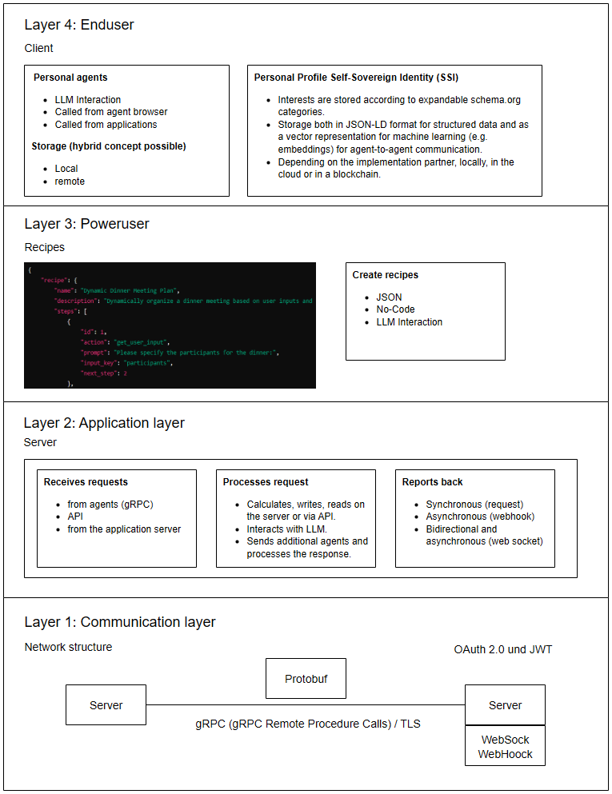

# **A decentralized agent-to-agent automation network**

**Abstract**: This project describes the concept of a decentralized network of autonomous software agents, called “AgentNetwork”. These agents can perform both simple and complex tasks autonomously in a distributed environment without relying on a central authority. The network consists of four layers: Communication and security layer, application layer, recipe and process layer and user layer with autonomous identity. It enables flexible interaction between agents via different communication models and supports a variety of use cases that we already know from the Internet today, such as travel bookings, health monitoring and business process automation. It also opens up completely new application possibilities that were previously unthinkable. Thanks to its decentralized architecture, the network is scalable, secure and supports the automation of complex processes in both the B2C and B2B sectors. It is supported by the A2AC consortium, which drives standards, security and innovation. This document is aimed at technically skilled individuals who wish to participate in or further develop the network.

## **Introduction**

### **Problem definition and motivation**   
The rapid development of information technology has fundamentally changed our lives. Computers, software and the Internet enable automation and global networking; the World Wide Web (WWW) has ushered in an era of global communication and global trade. Access to information and services is now easier and faster than ever before. However, the immense availability of information also leads to a new problem: users are overwhelmed. The multitude of sources and the fragmentation of information make it difficult to maintain an overview and make informed decisions.

Artificial intelligence (AI) offers the potential to meet this challenge by automating our ability to process information and make decisions. Specialized programs, known as agents, can act autonomously, gather information and make decisions based on it. These agents represent the next step in the evolution of technology, performing both simple and complex tasks more efficiently and faster than a human, while also using self-learning systems to independently find more effective ways of doing things.

In order to exploit the full potential of these agents, a network is needed that enables seamless interaction and communication between the agents. Such an agent network, similar to the WWW, must be decentralized and put people at the center by making their lives easier and more efficient. It must be secure, scalable and flexible to meet the demands of an increasingly complex world.

This paper introduces the concept of the agent network, explains its architecture, use cases and underlying technologies to provide a framework for development and implementation that meets the needs of developers, users and organizations.

## **System architecture and component overview**

The agent network is a multi-layered, decentralized system that enables seamless interaction between specialized programs (agents). These agents act on behalf of the users, collect information, process it and make decisions. The system is divided into four layers, each of which fulfills specific functions:

### **Communication and security layer (layer 1):**

This layer regulates communication between agents and services via gRPC and HTTP/2 with Protobuf as the data format. TLS secures the data transfer and optional end-to-end encryption increases the protection of sensitive information. This layer follows a zero-trust architecture with strict authentication and authorization (OAuth 2.0, JWTs).

### **Application layer (layer 2):**

The agents and services are implemented in this layer. Requests are processed via APIs and the results can be returned synchronously (request-response), asynchronously (webhooks) or in real time (websockets). This layer is flexible and allows the integration of external services as well as the development of own logic.

### **Recipe and process layer (layer 3):**

This layer controls workflows and automations. Users and developers can create “recipes” that automate tasks. This layer provides a low-code environment that offers flexibility to both less tech-savvy users and developers.

### **User level and autonomous identity (layer 4):**

Allows users to securely store and manage their personal data. This data can be used for personalized services, with the user retaining control over sharing. Requests are made anonymously by default and control is exercised via various interfaces (e.g. voice input, web interface).

### **Communication protocols and security precautions**

The agent network uses technologies such as gRPC, HTTP/2, Protobuf and TLS to ensure efficient and secure communication. A zero-trust architecture with OAuth 2.0 and JWTs ensures that only authorized access is allowed. This combination enables a scalable and secure network that meets the highest security standards.

To better understand the architecture of the agent network, the following diagram shows the different layers that make up the network. These layers have a modular structure to enable a flexible and scalable implementation.

### **Flexible communication models in the agent network**

A central component of the agent network is flexible communication between agents and servers, which can vary depending on the use case:

* Question / Answer (API-like): Agents make requests to the server and receive direct responses, similar to classic APIs (synchronous).  
* Specialized agent: A server acts as a specialized agent that receives requests, performs additional searches and provides well-founded answers asynchronously via webhook.  
* Direct agent exchange: Agents communicate directly with each other without an intermediary server. In this case, the agents communicate in real time using a web socket.  
* Indirect agent exchange: An agent communicates via an intermediary that establishes the connection to other agents.

These models enable efficient and scalable interaction in the network.

\[Grafik Server\]

The following figure provides an overview of possible market participants and basic services that can be integrated into the agent network. These players play a central role in the development and implementation of specific services and functions.

\[Grafik Dienste\]

## **Internet standardization process**

The AgentNetworkProtocolSecure (ANTS) protocol (ants://) is a standardized communication protocol developed specifically for decentralized, autonomous software agents in the AgentNetwork. It enables secure and efficient communication in various scenarios, including synchronous, asynchronous and real-time communication. This protocol offers the necessary flexibility, scalability and security to meet the requirements of a modern, decentralized network.

It will be submitted to the Internet Engineering Steering Group (EITF) as an RFC (https://www.ietf.org/process/process/) 

1. **Protocol Overview**  
   * Protocol Name: AgentNetworkProtocolSecure (ANTS)  
   * URL Schema: ants://  
   * Usage: Communication between autonomous agents in the agent network.  
2. **Layer Model**  
   a) **Communication and Security Layer**  
   * Transport Protocol: gRPC over HTTP/2, secured by TLS 1.3 or higher.  
   * Authentication: Using OAuth 2.0 and JWTs (JSON Web Tokens) for authentication and authorization.  
   * End-to-End Encryption: Optional but recommended to ensure privacy and security of communication.  
   * Protocol Versioning: Each message in the ANS protocol contains a protocol version header specifying the version used.  
3. b) **Message and Request Structure**  
   * **Request Types:**  
     * GET: Query information.  
     * POST: Submit data or instructions.  
     * PUT: Update existing data.  
     * DELETE: Delete data.  
   * **Extended Methods:**  
     * DELEGATE: Delegate a task to another agent.  
     * DELEGATE\_WITH\_CONDITIONS: Delegate with specific conditions (e.g., time limits, resource constraints).  
     * QUERY: Request specific information.  
     * UPDATE: Update status or data.  
     * CUSTOM\_QUERY: Define and execute complex queries.  
   * **Header Fields:**  
     * Agent-ID: Unique identification of the sending agent.  
     * Delegation-Flag: Indicates whether the request is made on behalf of another agent.  
     * Embedding-Info: Contains embeddings or metadata relevant to the context of the request.  
     * Response-Mode: Indicates whether a synchronous, asynchronous, or real-time response is expected.  
     * Timestamp: Timestamp of the request.  
     * Protocol-Version: Version of the protocol used.  
   * **Body:**  
     * Data Embeddings: Optionally contains machine-readable data for machine learning or processing.  
     * Response Requirements: Specifies whether a synchronous, asynchronous, or real-time response is expected.  
4. c) **Status Codes and Error Handling**  
   * **2xx (Success):**  
     * 200 OK  
     * 202 Accepted: Request accepted, but processing will be completed asynchronously.  
     * 204 No Content: Processing successful, but no return required.  
   * **3xx (Redirection):**  
     * 304 Not Modified: No changes since the last request.  
   * **4xx (Client Error):**  
     * 400 Bad Request: Invalid request.  
     * 403 Forbidden: Missing access rights.  
     * Extended Error Code: 450 More Information Required: The server needs additional information to process the request.  
   * **5xx (Server Error):**  
     * 500 Internal Server Error  
     * 503 Service Unavailable: Temporary overload or maintenance.  
     * Extended Error Code: 550 Processing Delay: Processing requires more time; the agent will be notified when the results are available.  
5. d) **Communication Models**  
   * **Synchronous:** Direct request and response, typically for simple queries.  
   * **Asynchronous:** Requests are accepted, but responses are returned later via webhooks or specialized callback mechanisms.  
   * **Real-Time:** Using WebSockets for continuous real-time communication.  
   * **Asynchronous Data Streams:** Standard methods ASYNC\_STREAM\_START and ASYNC\_STREAM\_STOP to handle continuous data streams.

### **3\. Security Considerations**

a) **Access Control and Anonymous Requests**

* **Authenticated Requests:** Most requests are secured by strict authentication and authorization mechanisms to ensure that only authorized agents can access specific functions and data.  
* **Anonymous Requests:** The protocol also supports the ability to make anonymous requests. The server can decide how to handle such requests.  
* **Header Field:** Anonymous requests should include an `Anonymous-Request: true` header.

b) **Encryption and Data Integrity**

* **End-to-End Encryption:** All requests, whether anonymous or authenticated, should by default be secured by TLS 1.3 or higher.  
* **Data Integrity:** Each message should be secured through cryptographic hashing to prevent manipulation.

c) **Audit Logging and Transparency**

* **Audit Logging:** Authenticated requests should be fully logged. For anonymous requests, the server decides how detailed the logging should be to maintain anonymity.  
* **Real-Time Monitoring:** Security events can be monitored in real-time to identify potential threats and maintain the system's integrity.

d) **Security Standards and Certifications**

* **Security Certifications:** Services implementing the ANS protocol can undergo security certifications to demonstrate compliance with best practices and standards.

### **4\. Backward Compatibility and Migration**

a) **Protocol Versioning**

* **Protocol-Version Header:** Each message contains a protocol-version header to ensure that all participants in the network are aware of the version being used.

b) **Compatibility Modes**

* **Backward Compatibility Mode:** The protocol supports a mode that ensures older versions of the protocol remain interoperable.

c) **Graceful Degradation**

* **Graceful Degradation:** The protocol allows for "graceful degradation," where functions that are not fully supported fall back on minimally functional alternatives to maintain communication.

### **5\. Description of the Protocol in Version 1.0**

In version 1.0 of the ANS protocol, the following core functions and features are provided:

* **Authentication and Anonymity:** Support for fully authenticated and anonymous requests that can be handled flexibly.  
* **Protocol Versioning:** Each message contains a protocol-version header to indicate the version of the protocol in use.  
* **Backward Compatibility:** A backward compatibility mode ensures that different versions of the protocol can communicate with each other.  
* **Graceful Degradation:** When certain functions are not supported, the system falls back on basic compatible alternatives.  
* **Security Mechanisms:** Integrated end-to-end encryption and measures to ensure data integrity. Audit logging for all requests, with special attention to maintaining anonymity for anonymous requests.  
* **Extendibility:** The protocol is designed to be easily extended to support future requirements without impairing core functionalities.

## **Use Cases and Applications**

The agent network offers a wide range of use cases that can transform both daily life and business processes. By automating tasks and efficiently processing information, it simplifies complex and time-consuming processes in both Business-to-Consumer (B2C) and Business-to-Business (B2B) sectors.

### **Overview of Use Cases:**

* **Travel Bookings and Price Monitoring:** Agents can identify the best flight prices, monitor price trends, and automatically book when a target price is reached.  
* **Health Monitoring and Research:** Agents continuously monitor research results on specific diseases and connect interested users with relevant studies.  
* **Restaurant Recommendations and Table Reservations:** Agents provide personalized restaurant recommendations and, with approval, automatically make table reservations.  
* **Group Planning and Event Coordination:** Agents coordinate appointments in social groups and handle event planning.  
* **Offering Real Estate Without Listing:** Users looking for new properties can anonymously offer their current property for sale or rent to receive direct offers or even exchange properties.  
* **Supporting Business Processes (B2B and B2C):** Agents automate business processes, facilitate collaboration, and enable secure interactions through extranet functions.

### **Detailed Use Cases:**

**Travel Booking and Price Monitoring:**  
A classic use case is the automation of travel bookings. Users can commission an agent to find the cheapest flight price for a specific route. The agent searches various flight booking services, compares prices, and makes recommendations. Additionally, the agent can monitor price trends over a period of time and inform the user when the price reaches a preset target. Once the target price is reached, the agent automatically completes the booking and notifies the user of the successful transaction.  
The following diagram illustrates the process:

**Health Monitoring and Research:**  
Agents can be deployed in the health sector to continuously monitor the latest research results relevant to specific diseases. They notify users as soon as new relevant information becomes available. Moreover, agents can connect patients with research institutions looking for participants in specific studies, facilitating access to important medical information and research.

**Restaurant Recommendations and Table Reservations:**  
Another example is personalized restaurant recommendations. The agent accesses the user's stored preferences, such as preferred cuisine, price expectations, or reviews, and suggests suitable restaurants based on guest reviews. Once the user makes a selection, the agent automatically handles the table reservation, confirming the appointment, significantly simplifying the process for the user.

**Group Planning and Event Coordination:**  
Coordinating appointments and events, particularly in social groups, can be cumbersome. Here, agents check the calendars of the participants, suggest possible dates, and collect feedback from attendees. Once a date is finalized, the agent can take over further organizational tasks, such as booking a venue or sending out invitations.

**Offering Real Estate Without Listing:**  
A user looking for a new property can anonymously offer their current apartment or house for rent or sale without publicly listing it. The search order is accompanied by an anonymous description and photos of the user's property. Other users or providers looking for a similar property can directly apply or trade real estate. This increases the market offerings and the chances of finding a suitable property, while maintaining the user's privacy, as all transactions remain anonymous until a concrete agreement is reached.

**Supporting Business Processes (B2B and B2C):**  
The agent network is also well-suited for automating business processes. Within an intranet, agents can support tasks such as production planning, HR tasks, or research activities. Through extranet functions, businesses can securely organize interactions with partners and customers without relying on open networks. This allows for tailored solutions to specific business needs and contributes to an efficient flow of information.

### **Future Perspectives and New Applications**

The agent network holds tremendous potential for new applications. Agents could, in the future, autonomously manage complex negotiation processes, make collective decisions, or develop new services. By integrating AI and machine learning, agents can evolve and adjust their strategies, making the network even more powerful and flexible.

The following diagram illustrates possible areas where the agent network can be applied. It highlights the diverse opportunities for utilizing the network and encourages the development of further innovative applications.

## **Scalability and Performance Considerations**

### **Decentralized Architecture and Scalability of the Agent Network**

The agent network operates within a distributed decentralized architecture, allowing services to be scaled and expanded independently, similar to the World Wide Web (WWW).

#### **Self-Regulation and Scalability:**

* **Decentralized Architecture:** Participants can host their own servers and services without a central authority, increasing flexibility and adaptability.  
* **Horizontal and Vertical Scaling:** Services can scale by adding more server instances or using more powerful hardware.  
* **Self-Organization:** New services and agents can be integrated seamlessly without disrupting the network.

#### **Load Distribution and Redundancy:**

* **Load Balancing:** Requests are evenly distributed across resources to avoid overload.  
* **Redundancy and Failover:** Redundant systems and failover mechanisms ensure high availability even in the event of failures.

#### **Efficiency Through Algorithms:**

* **Optimizing Algorithms:** Efficient resource utilization through intelligent load distribution and data traffic management.  
* **Predictive Models:** Early detection of bottlenecks and traffic spikes to maintain network performance.

#### **Extendibility and Customization:**

* **Modularity:** New services and agents can be easily integrated, promoting innovation and quick responses to market demands.  
* **Compatibility:** The network is compatible with existing technologies and protocols, making integration into existing systems easier.

The decentralized architecture of the agent network enables flexible scalability and adaptability. Intelligent load distribution, optimization algorithms, and modularity make it a future-proof platform for automation and information processing in a digital world.

## **Economic and Governance Aspects**

Implementing the agent network requires a clear economic and organizational structure, supported by the A2AC consortium (Agent-to-Agent Consortium). This consortium forms the backbone of governance and coordination within the network and ensures sustainable growth that benefits all participants.

### **1\. A2AC Consortium: The Backbone of the Agent Network**

The A2AC consortium is a central organization responsible for managing, standardizing, and advancing the agent network. It is comparable to the W3C (World Wide Web Consortium), which is responsible for developing and standardizing web technologies.

* **Governance Structure:** The A2AC consortium operates as a decentralized organization governed by the collective participation of members from various sectors. Decisions are made through consensus mechanisms that reflect the interests of different actors in the network.  
* **Standardization and Interoperability:** One of the primary tasks of the A2AC consortium is the development and maintenance of standards and protocols that ensure interoperability among all network participants. These standards enable agents to seamlessly communicate and collaborate across different platforms.  
* **Regulation and Compliance:** The consortium also defines the regulatory framework within which the network operates. This includes recommendations for compliance with data protection regulations, security standards, and ethical guidelines to build and maintain user trust.  
* **Promoting Innovation:** The A2AC consortium fosters innovation within the network by providing an open and transparent framework in which developers and companies can create new services and agents. This can be supported through open-source resources, funding programs, or the organization of hackathons and innovation competitions.

### **2\. Economic Actors and Business Models**

Companies and developers drive the network by monetizing services and technologies. Business models closely resemble those known from the WWW, such as subscriptions, usage-based fees, and advertising. An ecosystem of service providers, agent developers, trustees, and data providers will emerge, each developing and reinventing their own monetization models.

### **3\. Governance and Sustainability**

The consortium promotes decentralized decision-making to address the needs of all participants. It focuses on ethical guidelines, sustainable business models, and continuous adaptation to technological and regulatory changes to keep the network stable and innovative in the long term. However, the A2AC has limited influence over the behavior of participants, similar to the W3C, and cannot be held responsible for the activities of participants. Responsibility lies with the originators, who remain accountable to the respective legislators and enforcement authorities.

## **Security Considerations and Data Protection**

### **A2AC Consortium: Support and Framework for the Agent Network**

The A2AC consortium provides the framework for the agent network, similar to the W3C for web technologies. It develops standards and protocols, promotes interoperability, and provides tools to help participants adhere to recommended practices. Although the consortium has no direct control over participant behavior, it encourages adherence to privacy and security standards through optional certifications and initiatives. These measures are intended to strengthen trust in the network and ensure secure operations.

### **Economic Actors and Business Models**

Companies and developers leverage the network to offer their services and technologies within a standardized framework. While the consortium provides the infrastructure and recommendations, participants themselves are responsible for implementation and agent behavior.

* **Example: Data Protection Certification:**  
  A company offering a service within the agent network could voluntarily undergo a data protection certification recommended by the A2AC consortium. This certification would confirm that the service adheres to strict data protection regulations, such as not storing unnecessary user data, ensuring effective anonymization, and giving users full control over their data. Such certification would signal to users that the service upholds high data protection standards and builds trust in the service.  
* **Trustees and Intermediaries** can also opt for certification to further strengthen trust and security within the network. These certifications, for example, for data protection or security standards, are voluntary but contribute to trust-building measures.

## **Bad Actors: Protection Mechanisms in the Agent Network**

Defining a "bad actor" in the agent network is challenging and often depends on the context and perspective of the participants. While there are clear signs of malicious behavior, many cases are subjective and require flexible protection measures. The agent network offers several layers of mechanisms to ensure security and identify and block malicious actors.

### **Technical Level:**

* **Zero-Trust Architecture:** Continuous distrust of all participants, even within the network.  
* **Authentication:** Ensuring the identity of actors through mechanisms like OAuth 2.0 and JWTs.  
* **AI-Based Anomaly Detection:** Automated monitoring to detect suspicious behavior or unusual activities.  
* **Real-Time Monitoring:** Continuous monitoring of network traffic and agent activities.  
* **Protected Execution Environments and Resource Limits:** Ensuring that agents only access their assigned resources and act within set boundaries.  
* **Rate Limiting and Throttling:** Limiting the number of requests to prevent abuse and overloads.  
* **Security Protocols:** Use of modern security protocols like TLS 1.3 and above for encrypted communication.  
* **Self-Healing Networks:** Use of technologies like Multipath TCP, Software-Defined Networking (SDN), and mesh networks to mitigate attacks or failures.  
* **Audit Logs:** Detailed logging of agent activities for later review and analysis.

### **Agent Level:**

* **Optional Agent Certification:** Agents can undergo certification to enhance their trustworthiness.  
* **Public Key Infrastructure (PKI):** To verify the identity of agents and prevent spoofing.  
* **Trust Ratings:** Agents can receive trust ratings based on their past performance and behavior.

**User Level:**

* **Regular Verification:** Regular review of users, servers, and agents to ensure the integrity and security of the network.  
* **Identity Recognition and Age Verification:** Ensuring that participant identities are correct and that certain services are only accessible to authorized individuals.  
* **User Control:** Users can determine which trust levels are required for a request through agents and services to allow an interaction.

### **Community-Based Measures:**

* **Reputation System:** Agents, agent servers, and users are rated based on their behavior and trustworthiness.  
* **Web of Trust:** Building a trust network where agents, servers, and users are safeguarded through mutual evaluations and trust levels.  
* **Shared Blacklists:** Community-maintained blacklists that block and isolate bad actors.

## **Governance and Sustainability**

The consortium promotes decentralized decision-making and supports initiatives that keep the network sustainable and innovative. It provides a flexible infrastructure that can adapt to new technological and regulatory requirements. The A2AC, similar to the W3C, may operate its own infrastructure to support certifications. Despite this role, it has limited influence on participant behavior, and participants must continue to act independently and responsibly.

## **Conclusion and Outlook**

The agent network is an innovative platform that, through its decentralized architecture, flexible scalability, and high security standards, offers significant advantages for both end-users and businesses.

* **Decentralized Architecture:** Allows for independent scaling and extension of services, fostering flexibility and adaptability.  
* **A2AC Consortium:** Provides standards and tools, promotes interoperability and security, and emphasizes participant responsibility.  
* **Security and Data Protection:** Ensures high security standards, gives users full control over their data, and encourages transparency.  
* **Economics and Governance:** Offers a standardized framework and builds trust through optional certifications, while participants remain responsible for compliance with legal and ethical standards.

The network supports decentralized decision-making and promotes long-term sustainability and innovation. However, the network also relies on participants adhering to recommendations to meet the desired standards.

The potential of the agent network is enormous. While the first implementation focuses on automating and improving existing digital processes, the network will eventually unlock entirely new types of interactions and business models.

* **New Applications and Innovations:** Once the network is established, new applications and services will emerge that are currently unforeseeable. Agents may be able to autonomously manage complex tasks far beyond today’s capabilities, opening new markets and opportunities.  
* **Enhanced Role of AI and Machine Learning:** The integration of AI and machine learning into the agent network will allow agents to learn from experiences, adjust their strategies, and become increasingly responsive to user needs. This could lead to self-learning systems that proactively propose solutions and complete tasks before users even need to intervene.  
* **Transformation of Digital Interaction:** The agent network has the potential to fundamentally change how we interact with digital services. Instead of having to search for information or make decisions ourselves, agents could take over these tasks and simply present the best options to the user. This would significantly simplify and enhance the user experience.  
* **Challenges and Opportunities:** While the agent network offers many advantages, it also presents challenges. These include compliance with legal frameworks, privacy protection, and safeguarding against misuse. At the same time, these challenges offer opportunities for innovation and the development of new security and privacy technologies.

## **Final Remarks**

The agent network is more than just a technological innovation – it is a step into a new era of digital interaction. By creating an open, secure, and flexible network, it has the potential to fundamentally change how we deal with information and services. With the support of the A2AC consortium and active participation from developers, companies, and users, the network could become a key technology of the digital future.

## **Release Notes**

Daniel Niklaus  
V: 0.2  
2024.09.21

